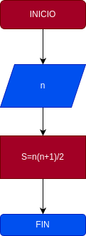

# Suma_n_Numeros
Suma de los n primeros números naturales

# Analisis

## Input

## Variables de entrada
n= valor al ingresar

## processing
S=suma de los n primeros numeros naturales

S=(n*(n+1))/2
### Oupot
S

# Diseño

